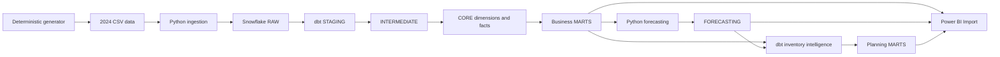
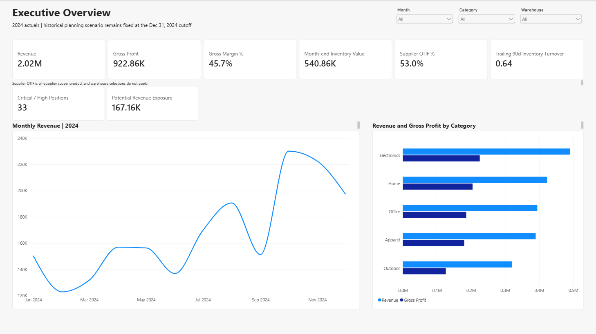
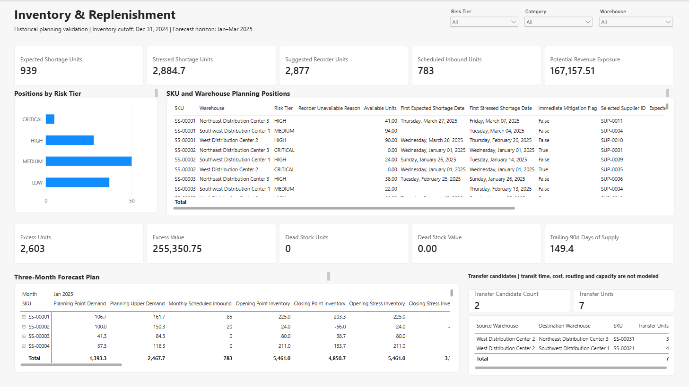

# SupplySight

SupplySight is a supply-chain analytics platform for a fictional retailer. It generates operational data, ingests it into Snowflake, builds a tested dbt warehouse, evaluates demand forecasts, produces inventory-planning guidance, and presents the historical results in Power BI.

**Stack:** Python · Snowflake · dbt · Airflow · Docker Compose · GitHub Actions · Power BI

## What problem does it solve?

The platform brings orders, inventory, suppliers, shipments, and returns into one analytical model. It helps examine where modeled shortages may occur, which positions merit reorder review, where a warehouse transfer might help, how suppliers and carriers perform, and how much trust to place in demand forecasts.

## Architecture



[Architecture and ownership boundaries](docs/architecture.md) explain how Airflow, Docker, testing, CI, and read-only BI access support this flow.

## What the project demonstrates

- **Traceable source processing:** fixed-seed, linked operational records; whole-dataset preflight; idempotent RAW merges; batch audits and quality quarantine.
- **Governed analytics:** typed staging, eligibility and exception handling, conformed dimensions and facts, warehouse-observed SCD Type 2 product history, business marts, and dbt reconciliation tests.
- **Reproducible workflows:** manual Airflow DAGs in Docker Compose, a locked Windows Python environment, and credential-free CI checks. Live DEV validation is a separate manual workflow.
- **Measured decision support:** chronological comparison of a simple demand baseline with damped Holt; historical inventory risk, reorder, and transfer calculations; a four-page Power BI Import report.
- **Curated BI access:** `POWERBI_READER` can read CORE, MARTS, and FORECASTING through a dedicated DEV read role; it is not a RAW ingestion role.

## Historical validation using synthetic 2024 operational data

The persisted DEV scenario uses **54,789 synthetic source rows** across nine CSVs, including **5,000 order lines** and **277 returns**. In 2024, eligible sales produced **2,017,378.43** in recognized revenue, **1,094,518.74** in COGS, and **922,859.69** in gross profit (**45.75%** margin). The December month-end inventory value was **540,863.35**. Returns totaled **467 units** and **92,016.85** in refunds; returns and refunds remain separate from recognized revenue.

The 2024 logistics mart contains **4,740** eligible shipments and **11,312** shipped units. Of **4,299** shipments eligible for timeliness, **3,305** were on time and **994** were late (**76.88%** on time); **4,343** shipments were completed. At the December cutoff, trailing-90-day delivered demand was **3,304 units**, inventory turnover was **0.639**, and days of supply was **149.45**.

The forecast uses observations through **Dec 31, 2024** and covers **Jan–Mar 2025**: **120** product × warehouse series and **360** forecast rows.

The trailing three-month mean beat the damped Holt candidate on paired validation series (**5.11 vs 5.99 units mean MAE**), so the baseline was selected for all 120 series. Holdout MAE was **7.09**, RMSE **10.17**, and WAPE **61.05%**. Forecast accuracy remains limited; the model-selection result does not imply reliable production forecasts.

The persisted historical planning scenario evaluated **120** inventory positions: **5 Critical, 28 High, 50 Medium, and 37 Low**. It produced **78** positive reorder suggestions totaling **2,877 units** and **2** transfer allocations totaling **7 units**. Potential revenue exposure was **167,157.51** in source currency. These are modeled decision-support outputs, not observed lost sales or executable orders. The report has **four pages**. [Forecasting](docs/forecasting.md) and [inventory intelligence](docs/inventory_intelligence.md) document the methods and full reconciliations.

## Power BI report

The four-page [Power BI project](powerbi/SupplySight.pbip) covers Executive Overview, Inventory & Replenishment, Supplier & Logistics, and Forecasting & Demand. It imports curated DEV outputs and checks that the historical forecast and planning runs are compatible before refresh. Power BI Desktop refreshed successfully against the corrected DEV build; the screenshots below show that historical result. See the [report gallery](docs/power_bi.md#report-gallery) for all four pages.

**Executive Overview**

<a href="docs/images/powerbi/executive-overview.png"></a>

**Inventory & Replenishment**

<a href="docs/images/powerbi/inventory-replenishment.png"></a>

## Repository structure

| Path | Contents |
| --- | --- |
| `src/supplysight/`, `scripts/` | Generator, ingestion, forecasting, and operational CLIs |
| `sql/`, `dbt/` | DEV object definitions, transformations, snapshots, and tests |
| `airflow/` | Manual DAGs and Docker Compose environment |
| `powerbi/` | Authored PBIP, PBIR, and TMDL report source |
| `tests/`, `.github/workflows/` | Python tests and validation workflows |
| `docs/` | Architecture, data model, setup, and engineering runbooks |

## Getting started

On the validated Windows Python **3.13.7** environment, create a virtual environment, install the committed lock and package, then run local checks:

```powershell
py -3.13 -m venv .venv
.\.venv\Scripts\python.exe -m pip install -r requirements.lock
.\.venv\Scripts\python.exe -m pip install --no-build-isolation -e .
.\.venv\Scripts\python.exe -m pip check
.\.venv\Scripts\python.exe -m ruff check src scripts tests
.\.venv\Scripts\python.exe -m pytest -p no:cacheprovider
```

The [setup guide](docs/setup.md) covers credential-free dbt/Docker checks and the separately approved full DEV historical build. A Snowflake account, authorized DEV infrastructure, private-key authentication, Docker Desktop, and Power BI Desktop are required for that full path; the repository does not provision them.

## Testing and CI

Automatic [CI](docs/ci_cd.md) checks dependency health, Ruff, pytest, dbt parse with placeholders, Compose configuration, an Airflow image build, DAG imports, and tracked credential files. The separate manually dispatched DEV workflow compiles and tests existing dbt relations. Neither workflow deploys to production.

## Limits and future work

The source is synthetic 2024 history. The Jan–Mar 2025 forecast and planning output are a **historical validation scenario, not live 2026 recommendations**. Holdout error is high; inventory risk tiers are rules rather than calibrated probabilities; shortage and revenue exposure are modeled, not observed losses. Transfers omit transit time, cost, routing, and capacity. Reorder quantities support review and do not place orders. Longer observed history and calibrated uncertainty, followed by transfer feasibility modeling, are possible future extensions.

## Documentation

| Start here | Detail |
| --- | --- |
| [Architecture](docs/architecture.md) · [Data model](docs/data_model.md) | Pipeline, ownership, grains, and lineage |
| [Setup](docs/setup.md) · [Data contracts](docs/data_contracts.md) | Reproduction and source definitions |
| [Forecasting](docs/forecasting.md) · [Inventory intelligence](docs/inventory_intelligence.md) | Methods, measured results, and limits |
| [Power BI](docs/power_bi.md) · [CI/CD](docs/ci_cd.md) | Semantic model, report, and validation |
