# Architecture

SupplySight separates source handling, analytical definitions, forecast evaluation, and presentation. The development target is `SUPPLY_CHAIN_DEV` on `SUPPLY_CHAIN_DEV_WH`; the repository does not provision a Snowflake account.

```mermaid
flowchart LR
    subgraph Local[Local source processing]
        GEN[Python deterministic generator] --> CSV[Nine linked CSV files]
        CSV --> ING[Python preflight and ingestion]
    end
    subgraph SF[Snowflake SUPPLY_CHAIN_DEV]
        RAW[RAW: source and load audit]
        STG[STAGING: typed views]
        INT[INTERMEDIATE: eligibility and exceptions]
        CORE[CORE: dimensions and facts]
        MARTS[MARTS: business reporting]
        FC[FORECASTING: runs, evaluation, forecasts]
        PLAN[INTERMEDIATE and MARTS: inventory planning]
    end
    ING --> RAW --> STG --> INT --> CORE --> MARTS
    MARTS --> PYFC[Python demand forecasting] --> FC
    MARTS --> DBTPLAN[dbt inventory intelligence]
    FC --> DBTPLAN --> PLAN
    CORE --> PBI[Power BI Import model]
    MARTS --> PBI
    FC --> PBI
    PLAN --> PBI
    AF[Manual Airflow DAGs] -. invokes .-> GEN
    AF -. invokes .-> ING
    AF -. invokes .-> STG
    AF -. invokes .-> PYFC
    AF -. invokes .-> DBTPLAN
    DOCKER[Docker Compose] -. hosts .-> AF
    CI[GitHub Actions] -. validates code, dbt parse, image and DAGs .-> AF
```

Python validates the complete related CSV set before ingestion and owns RAW merges, batch audits, and quarantine records. dbt owns normalization, eligibility, dimensional modeling, business measures, and inventory calculations. Python forecasting reads eligible mart order demand and persists run metadata, evaluation, and monthly predictions. Power BI imports curated CORE, MARTS, and FORECASTING outputs; Power Query checks that the forecast and historical planning runs agree before refresh.

The two Airflow DAGs are manually triggered. Docker Compose runs Airflow with a local Postgres metadata database. Airflow orchestrates existing commands; it does not redefine their business rules. Its forecast freshness guard rejects the fixed 2024 history as a current forecast in 2026. Reproducing the historical planning scenario therefore uses the explicitly approved manual path in [setup](setup.md).

Automatic [CI](ci_cd.md) checks source and local build integrity without Snowflake credentials. A separate manual workflow compiles and tests existing DEV relations. The DEV service role can perform approved source and warehouse writes. `POWERBI_READER` is a read-only curated analytics role with warehouse/database usage and CORE, MARTS, and FORECASTING usage and SELECT; it has no RAW or STAGING grants through this setup. See [the data model](data_model.md), [orchestration](orchestration.md), and [Power BI](power_bi.md) for layer details.
