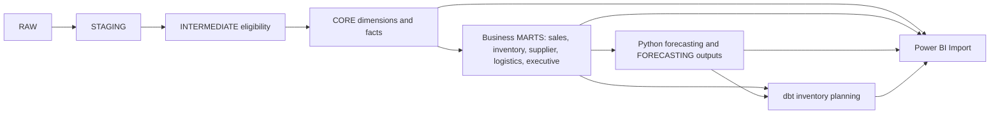

# Analytics data model

CORE has conformed dimensions and five fact tables. The diagram shows primary analytical joins, not every optional date or source lineage column. Every fact retains its source business identifier for reconciliation.

```mermaid
erDiagram
    DIM_DATE ||--o{ FACT_ORDERS : order_date_key
    DIM_DATE ||--o{ FACT_INVENTORY_SNAPSHOT : snapshot_date_key
    DIM_DATE ||--o{ FACT_PURCHASE_ORDERS : order_date_key
    DIM_DATE ||--o{ FACT_SHIPMENTS : ship_date_key
    DIM_DATE ||--o{ FACT_RETURNS : return_date_key
    DIM_PRODUCT ||--o{ FACT_ORDERS : product_key
    DIM_PRODUCT ||--o{ FACT_INVENTORY_SNAPSHOT : product_key
    DIM_PRODUCT ||--o{ FACT_PURCHASE_ORDERS : product_key
    DIM_PRODUCT ||--o{ FACT_SHIPMENTS : product_key
    DIM_PRODUCT ||--o{ FACT_RETURNS : product_key
    DIM_WAREHOUSE ||--o{ FACT_ORDERS : warehouse_key
    DIM_WAREHOUSE ||--o{ FACT_INVENTORY_SNAPSHOT : warehouse_key
    DIM_WAREHOUSE ||--o{ FACT_PURCHASE_ORDERS : warehouse_key
    DIM_WAREHOUSE ||--o{ FACT_SHIPMENTS : warehouse_key
    DIM_WAREHOUSE ||--o{ FACT_RETURNS : warehouse_key
    DIM_CUSTOMER ||--o{ FACT_ORDERS : customer_key
    DIM_CUSTOMER ||--o{ FACT_SHIPMENTS : customer_key
    DIM_CUSTOMER ||--o{ FACT_RETURNS : customer_key
    DIM_SUPPLIER ||--o{ FACT_PURCHASE_ORDERS : supplier_key
    DIM_CARRIER ||--o{ FACT_SHIPMENTS : carrier_key
    DIM_DATE {
        number date_key PK
    }
    DIM_PRODUCT {
        string product_key PK
        string product_id
        timestamp valid_from
        timestamp valid_to
    }
    DIM_WAREHOUSE {
        string warehouse_key PK
        string warehouse_id
    }
    DIM_CUSTOMER {
        string customer_key PK
    }
    DIM_SUPPLIER {
        string supplier_key PK
    }
    DIM_CARRIER {
        string carrier_key PK
    }
    FACT_ORDERS {
        string order_fact_key PK
        string order_line_id
        string product_key FK
    }
    FACT_INVENTORY_SNAPSHOT {
        string inventory_snapshot_key PK
        string product_key FK
    }
    FACT_PURCHASE_ORDERS {
        string purchase_order_fact_key PK
        string po_line_id
        string product_key FK
    }
    FACT_SHIPMENTS {
        string shipment_fact_key PK
        string shipment_id
        string product_key FK
    }
    FACT_RETURNS {
        string return_fact_key PK
        string return_id
        string product_key FK
    }
```

| CORE fact | Grain |
| --- | --- |
| `fact_orders` | One eligible order line |
| `fact_inventory_snapshot` | One product and warehouse on one snapshot date |
| `fact_purchase_orders` | One purchase-order line |
| `fact_shipments` | One shipment |
| `fact_returns` | One return |

`dim_product.product_key` identifies a warehouse-observed SCD Type 2 version; stable `product_id` identifies the product across versions. Facts resolve a version at the event date. Because the first observed product snapshot followed the generated 2024 events, those events use the earliest known version and carry a `product_history_fallback` flag. Its attributes are descriptive fallback, not verified 2024 attributes. Other dimension keys are stable surrogate keys; `dim_date.date_key` is a calendar integer. Snowflake standard-table key declarations are informational, so dbt tests and reconciliations enforce the intended grains.

## From facts to decisions

The business marts contain detail and monthly aggregates at documented grains; inventory planning adds daily intermediate views and monthly, recommendation, and transfer marts. Power BI uses curated projections and a stable-product dimension, not a copy of this CORE ERD. Its semantic relationships, including a role-playing source warehouse and separate supplier spend/service month projections, are documented in [Power BI](power_bi.md). For individual model definitions and tests, see [dimensional warehouse](dimensional_warehouse.md) and [business marts](business_marts.md).
