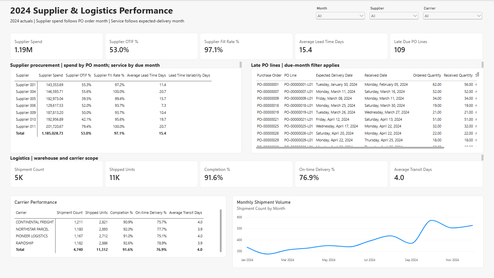
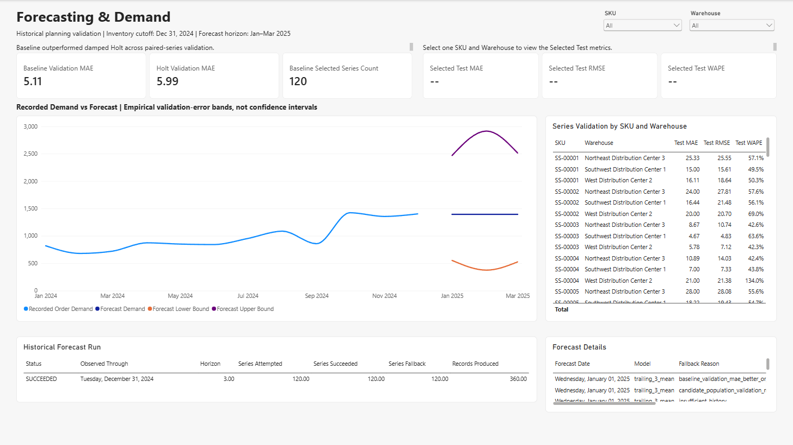

# Power BI reporting layer

## Purpose and connection

The Power BI project in `powerbi/` is the business-intelligence consumption layer for SupplySight. It uses **Import** mode against `SUPPLY_CHAIN_DEV` and `SUPPLY_CHAIN_DEV_WH`. Import keeps this small historical portfolio model responsive and makes report interactions independent of repeated Snowflake queries. Refresh locally after validating the source scenario; credentials remain in the local Power BI credential store and are not committed.

Use the implemented `POWERBI_READER` role for interactive DEV access. Its curated read grants require:

| Object scope | Required grant |
| --- | --- |
| Warehouse `SUPPLY_CHAIN_DEV_WH` | `USAGE` |
| Database `SUPPLY_CHAIN_DEV` | `USAGE` |
| Schemas `SUPPLY_CHAIN_DEV.CORE`, `SUPPLY_CHAIN_DEV.MARTS`, and `SUPPLY_CHAIN_DEV.FORECASTING` | `USAGE` on each schema |
| Existing relations in each of those schemas | `SELECT ON ALL TABLES` and `SELECT ON ALL VIEWS` |
| Relations created or recreated in each of those schemas | `SELECT ON FUTURE TABLES` and `SELECT ON FUTURE VIEWS` |

The first Desktop refresh after the corrected dbt rebuild failed because recreated relations had lost object-level `SELECT` grants. Current and future grants were then applied to the live DEV role, and Desktop refresh succeeded. Both kinds of SELECT grant matter: future grants cover subsequent dbt creations or replacements, while grants on all existing relations repair objects already present. This setup grants `POWERBI_READER` no RAW or STAGING access. The DEV service/write role used for ingestion and builds is separate. Do not configure production credentials or store Power BI authentication state in the repository.

## Source boundary and model

The model imports only business-ready CORE dimensions, monthly MARTS outputs, inventory-planning marts, and forecast outputs:

| Semantic table | Snowflake source | Grain and purpose |
| --- | --- | --- |
| CalendarMonth | `CORE.DIM_DATE` projected to one row per month | Month reporting dimension; ordinary dimension, not marked as a Power BI date table |
| Product | `CORE.DIM_PRODUCT` current descriptive version projected to stable `product_id` | One row per product business ID |
| Warehouse, Supplier, Carrier | `CORE.DIM_WAREHOUSE`, `CORE.DIM_SUPPLIER`, `CORE.DIM_CARRIER` | One row per warehouse, supplier, and normalized carrier |
| SalesMonth | `MARTS.SALES_MONTHLY` | Monthly sales aggregation; product version lookup adds stable `product_id` from `product_key` |
| InventoryMonth | `MARTS.INVENTORY_MONTHLY` | Monthly product × warehouse inventory metrics |
| SupplierSpendMonth / SupplierServiceMonth | Two projections of `MARTS.SUPPLIER_MONTHLY` | Supplier × PO order month for spend; supplier × expected-delivery month for service |
| SupplierLine | `MARTS.SUPPLIER_DETAIL` | PO-line detail restricted to the mart's late-as-of-cutoff flag, including expected delivery and receipt status |
| LogisticsMonth | `MARTS.LOGISTICS_MONTHLY` | Monthly carrier × warehouse logistics metrics |
| ForecastMonth | `FORECASTING.CURRENT_FORECASTS` | Forecast run × product × warehouse × month |
| ForecastEvaluation | `FORECASTING.MODEL_EVALUATION` | Run × product × warehouse model evaluation |
| ForecastRun | `FORECASTING.RUN_METADATA` | One row per forecast run; status and coverage metadata |
| PlanningMonth | `MARTS.MART_INVENTORY_PLANNING_MONTHLY` | Run × product × warehouse × forecast month |
| Recommendation | `MARTS.MART_INVENTORY_RECOMMENDATIONS` | Run × product × warehouse planning position |
| Transfer | `MARTS.MART_INVENTORY_TRANSFERS` | Run × product × source warehouse × destination warehouse |

The product-version lookup is a Power Query staging query and is not loaded as a report table. Sales uses it to resolve SCD2 `product_key` values to stable `product_id`; it does not join historical facts directly to multiple product versions. Product attributes shown for the 2024 period are descriptive fallback attributes, not verified historical category states.

RAW, STAGING, CORE facts, `MARTS.SALES_ORDER_LINE`, `MARTS.INVENTORY_DETAIL`, `MARTS.SHIPMENT_DETAIL`, return and quality marts, executive monthly rollups, and intermediate planning models are deliberately outside the report import boundary. The executive rollup mixes different event-date cohorts and must not be treated as a uniform sales timeline.

### Relationship behavior

All relationships are single-direction, one-to-many from dimensions to facts. There are no fact-to-fact, bidirectional, or many-to-many relationships.

- Product filters supported sales, inventory, forecast, planning, recommendation, and transfer tables by stable `product_id`.
- Warehouse filters warehouse-grain facts. `Warehouse` is the active destination side of Transfer; `SourceWarehouse` is a role-playing copy used for the source side.
- Supplier filters supplier facts and recommendation supplier context. A selected supplier on a recommendation is the most recent eligible historical PO supplier, not an assigned future-order supplier.
- Carrier filters logistics only.
- CalendarMonth filters monthly actuals, forecast months, planning months, and SupplierLine by its expected-delivery month. Supplier spend and service use separate month projections to preserve order-month versus due-month meaning.
- Recommendation and Transfer have no CalendarMonth relationship. They represent the fixed Jan–Mar planning horizon and must not change with the ordinary 2024 actual-month selector.
- ForecastRun filters forecast and planning outputs by run lineage.

CalendarMonth has one row per month and is not marked as a Power BI Date Table, because the table does not contain a contiguous daily date column. Automatic date hierarchies are disabled or avoided. Inventory balances are semi-additive: a multi-month selection displays the latest selected month, not the sum of month-end balances.

## Governed measures

Warehouse/dbt owns business definitions including recognized revenue and gross profit, supplier service flags, inventory turnover inputs, risk tiers, shortage calculations, reorder quantities, exposure and transfer allocation. Power BI measures aggregate those published values, calculate ratios from additive components, select the latest inventory month and format results.

The report measure layer includes revenue, gross profit, gross margin, latest month-end inventory value, trailing-90-day turnover and days of supply, supplier spend, OTIF and fill rates, lead time, late PO lines, shipment counts and units, completion/on-time rates, weighted transit days, forecast demand and bounds, selected-series validation metrics, paired baseline/Holt validation MAE, risk-position counts, expected/stressed shortage, reorder positions/units, scheduled inbound, potential revenue exposure, and transfer candidates/units. Percentages are calculated from summed numerators and denominators where available; unavailable metrics remain blank. Per-series WAPE and RMSE are not averaged into unsupported population metrics.

## Report pages

1. **Executive Overview** — 2024 revenue, gross profit, gross margin, latest selected month-end inventory, supplier OTIF, and trailing-90-day inventory turnover. A visually separate planning callout shows critical/high positions and potential revenue exposure; this callout is independent of the 2024 month selector.
2. **Inventory & Replenishment** — risk-tier distribution; expected and stressed shortage; suggested reorder units; scheduled inbound; potential revenue exposure; position-level recommendations; monthly planning paths; December 2024 excess/dead-stock context; and transfer candidates. Missing supplier/reorder inputs remain visible.
3. **Supplier & Logistics** — supplier spend, OTIF, fill, lead time, late PO details and supplier comparison, alongside a visually distinct carrier/logistics section with shipment, completion, on-time and weighted transit measures. Spend is by PO order month; service and late PO filtering use due month.
4. **Forecasting & Demand** — 2024 recorded order-intent demand and Jan–Mar 2025 point forecasts with empirical validation-error bands, selected model and fallback details, selected-series metrics, and paired baseline/Holt comparison. The population comparison shows baseline mean validation MAE near 5.11 versus damped Holt near 5.99; the baseline won the gate and all 120 series used it.

The Inventory and Forecasting pages display: **“Historical planning validation | Inventory cutoff: Dec 31, 2024 | Forecast horizon: Jan–Mar 2025.”** Forecast bounds are empirical validation-error bands, not confidence intervals. Risk tiers are deterministic rules, not probabilities. Expected shortage is modeled inventory needed to keep the point path nonnegative, not lost sales. Suggested reorders are decision support, not purchase orders. Potential revenue exposure uses expected shortage × historical realized unit value; it is not expected or guaranteed lost revenue. Transfer rows are candidates without modeled transit time, cost, routing, or capacity feasibility.

## Report gallery

These Power BI Desktop captures show the corrected persisted DEV historical scenario after a successful Desktop refresh. The source observations end on December 31, 2024; the forecast and planning horizon is January–March 2025. Select a thumbnail to view the full image.

| Executive Overview | Inventory & Replenishment |
| --- | --- |
|  |  |
| Supplier & Logistics | Forecasting & Demand |
|  |  |

## Scenario lineage and refresh

Before imported forecast/planning data are accepted, the Power Query source validation checks that one compatible forecast run is `SUCCEEDED` and has `observed_through = 2024-12-31`. Evaluation keys are checked only for the current forecast run; older evaluation rows remain valid history. For every product/warehouse series, forecast and planning data must each contain exactly one row for January, February, and March 2025, and both must match the same `forecast_run_id` used by the inventory-recommendation mart. The guard also compares product/warehouse key sets across forecast, evaluation, planning, and recommendation outputs. A mismatch, duplicate month, or incomplete horizon raises a clear query error; refresh must not combine a replacement `CURRENT_FORECASTS` run with historical planning outputs.

Power BI Desktop refreshed successfully against the corrected DEV relations with the repaired `POWERBI_READER` grants. To reproduce that import locally, open `powerbi/SupplySight.pbip` in a compatible Power BI Desktop release. The `SnowflakeServer` Power Query parameter contains the project's DEV account host; change it if your authorized DEV account differs. Configure local DEV credentials with `POWERBI_READER`, then refresh the model. Confirm the validation query succeeds before reviewing report values. Do not commit credentials, cache files, or local editor-setting changes. This report is an imported historical scenario, not a continuously current operational report.

## Reconciliation and limitations

The refreshed report reconciles to the corrected persisted DEV scenario. For 2024 actuals, recognized revenue is **2,017,378.4280**, COGS **1,094,518.74**, gross profit **922,859.6880**, and gross margin **45.745492%**. December month-end inventory value is **540,863.35**. Supplier OTIF has **124** on-time-in-full lines from **234** due lines. The logistics cohort contains **4,740** shipments and **11,312** shipped units; **4,343** were completed. Timeliness covers **4,299** shipments: **3,305** on time and **994** late, giving **76.878344%** on time. Mean transit time is **3.965231** days. Eligible returns total **277** records, **467** units, and **92,016.85** in refunds.

At the December cutoff, trailing-90-day delivered demand is **3,304** units and COGS is **343,870.58**; inventory turnover is **0.639033287** and days of supply **149.447762079**. The historical forecast has **120** series, **360** rows, and **101** comparable validation series. Paired baseline/Holt validation MAE is **5.114411 / 5.989852**; holdout MAE, RMSE, and WAPE are **7.088889**, **10.173040**, and **61.052632%**. Planning has **120** positions with **5 / 28 / 50 / 37** critical/high/medium/low tiers, **78** positive reorder positions totaling **2,877** units, and **2** transfer allocations totaling **7** units. Potential revenue exposure is **167,157.510213** in source currency. These persisted values are reconciliation facts, not hard-coded report constants.

The source history is synthetic and ends on 2024-12-31. January–March 2025 forecasts and planning recommendations are historical validation outputs with no realized forecast-period outcomes in the project. Holt underperformed the baseline and forecast error is high. Six planning positions have no selected supplier and therefore no available reorder quantity. Only two transfer allocations were produced. Monetary values remain in source currency; no currency conversion is performed. Product history before first observation uses fallback attributes. These constraints should remain visible where they affect interpretation.
